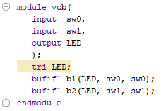
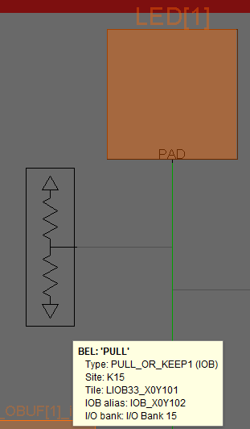

# Voltage Controlled Buffers

Obviously computers are built with physical things called transistors, silicon and maybe you have read about the sharped edge sand that is needed to grow silicon crystals. We could start this course talking about how to grow silicon crystals from sand. But we don't because this is not where innovative, rapid technology evolution or growth is occurring. We have to focus on where engineering design is happening now. 

Inbetween gates such as NAND, AND and transistors there is a logical device called a voltage controlled buffer from all gates can be built. 

## TriState Logic

Two wall light switches can control one light in our homes. These are called 3 way switches at Lowes or Home Depot. Why three way?

Digital electronics call these tri-state. Both the light switches and digital electronics require three wires. A state is on .. light on. Another state is off .. light off. The third state is disconnected, open or high output impedance.  The third state is not driven .. meaning no energy is output. Some other output can take control of the wire. 

Most nets are driven by one source. If driven by two sources that agree (both logical 1 or both logical 0), then no problem. But if they disagree  there  will be smoke. Something will break. Xilinx, through the Vivado software checks for this and doesn't allow it to happen to their FPGA chip. But there is a way to allow both switches to drive a single  LED. 

Verilog assumes that a net or wire is two state.  The line with tri LED;   below  changes this default to three states. The verilog primitive "bufifi" is an instruction to create a tristate buffer. Two are created below called b1 and b2.    

Either of the two tristate buffers can drive the LED. 

*How is the above different from the two state situation?*   
When sw0 is 0, the tristate buffer doesn't try to ground the LED. It outputs nothing.    

*What is the difference between 0 (false) and nothing?*  
Nothing means not hooked up. Nothing means the tristate  buffer output wire is logically cut.  Open. Infinite output impedance.  Off.  If sw=0 and sw1=1 there will not be a fight.  Switch1 (sw1)  will win. Switch2 (sw2) has checked out of the game.   

*So what is the difference between 0 and off?*    
There is not difference in a two state circuit. There is a difference in a tristate buffer circuit. Off means disconnected. 0 means remove all energy from the wire. 

*What is the difference between 0 and 1?* 0 means remove all energy from the wire. Stop it from acting like an  antenna. 1 means flood the wire with energy. Build up the pressure.

*So what if both sw1 and sw2 are both 0?*  Can a blue tooth wireless transmission cause the wire to fill up with electromotive force EMF and cause the LED to glow? Yes! This is the drawback.  

*Is this something a designer should be worried about?* Yes! When working with tristate wires, have to make sure that the wire is driven by some input at all times. Could be driven to 1 or driven to a 0.

*How is the wire to the LED driven if both SW0 and SW1 are both zero?* This is done through a pull down resistor. Prior to the LED input, a large resistor is connected to ground. This drives the input to the LED to ground so leakage from other components, bluetooth or wifi signals are not picked up by the dangling wire into the LED and strong enough to cause the LED to glow.  

*Why didn't you put a pull down resistor in the circuit?* Vivado does it automatically.

Why emphasis on tristate in this lab? 

1. An entire computer can be built with tristate buffers. Printers from the 1970's by HP were sometimes built entirely with tristate buffers. Nothing else. 
2. Seven segment displays and RAM use tristate to cut down on the number of wires or nets required by using tristate.

## #######################################

