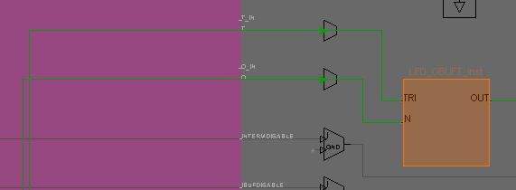

# AndNand
The goals of this lab are to begin looking at the ways **Vivado** modifies our code.   

**Vivado** tires to get rid of constants.   

**Vivado** looks at different verilog abstractions of the same circuit and does what?   

**Vivado** simplifies circuits we tell it to build, freeing us from trying to build efficient circuits.

## project_1 constants

Project_1 is playing with voltage controlled buffers just like the previous lab, except it is using constants.

#### Port Diagram

#### Verilog Code

`timescale 1ns / 1ps

module vcb(
   input  sw0,
   input  sw1,
   output tri LED
   );
   tri w;
   bufif1 b1(w, 1, sw0);
   bufif1 b2(w, 1, sw1);
   assign LED=w;
endmodule

#### RTL Schematic Screen shot

#### Synthesis Schematic Screen shot

#### Implementation Device screen shot zoomed in on something interesting

This is the chip that shows the tri state and input for the LED

#### Testing

Throw the SW0 and SW1 switches, they should power the LD0 LED when either or both are on.

*A logical 1 is visible in the verilog code (vcb.v) and yet the RTL analysis schematic gets rid of the logical constant and is identical to the previous lab. Why? Draw a diagram similar to the RTL analysis with containing the design intent of the verilog code.*

​	This constant is inefficient so Verilog optimizes the circuit for you.

*What happens if the order of 1 and sw0  are switched (and the order of 1 and sw1) in the verilog code?*

​	You get an error at implementation due to the multiple driven nets. switching the two effectively removes the tristate buffer, as the "switch" in the tristate is always high.

Comment out the lines:

​	set_property CFGBVS VCCO [current_design]
​	set_property CONFIG_VOLTAGE 3.3 [current_design]

in the xdc file. 

*What error messages are generated?*   

​	I got a single warning message, in the implementation phase referencing the lack of these two lines

*Which (RTL, Synthesis, Implement or Generate Bitstream) causes failure?* 

​	The program ran despite the lack of these two lines

*Which starts complaining first about these two lines?*

​	Implementation has the first warning message. 

*What technology is in the Xilinx FPGA we are using TTL, CMOS, etc. ? Provide a link to the web site where you looked up the answer.*

*What is w in the verilog code? Is it necessary?* 

​	It is a variable that has 3 possible states, true, false, and don't care. It is not necessary in this code as LED is already written as tri, and can therefore replace the variable w.

## project_2 andGates

In this project an "And" gate is created four different ways. Test it. Show your instructor all four ways working. 

#### Port Diagram

#### Verilog Code

#### RTL Schematic Screen shot

#### Synthesis Schematic Screen shot

#### Implementation Device screen shot zoomed in on something interesting

#### Testing

*Which of the four ways is the most attractive way to code?*

*At what level of verilog code abstraction is the **assign** command?*

*Does order of the verilog commands (sequence of commands) change anything?*

*What are a1,b1,n1,n2 associated with the gate names called in Verilog?*

*In the language C, the names between () look like variables passing data to some kind of function, object or subroutine. What do the represent in verilog?* 

*At what step (RTL, Synthesis, Implementation, BitFile) did Vivado figure out that most of the LED's were doing the same thing?* 

*Implement each and gate one at a time. List any differences between them at the RTL or Synthesis states here. Take screen shots if you want or describe them verbally.* 

## project_3 XOR and Nand Gates

You create this from scratch.

Use the "[assign](https://www.utdallas.edu/~akshay.sridharan/index_files/Page5212.htm)" command, 3 switches, and 2 LEDs to create a three input Nand gate and a three input XOR gate. Put them all in one project. 

#### Port Diagram

#### Verilog Code

#### RTL Schematic Screen shot

#### Synthesis Schematic Screen shot

#### Implementation Device screen shot zoomed in on something interesting

#### Testing

*XOR gates have evolved with [two different implementations](https://en.wikipedia.org/wiki/XOR_gate#More_than_two_inputs) with three or more inputs.  Which does the verilog assign command implement?*

## Ethics

The ethics questions below are more important than your answers. The goal in answering them is to remember the question. So the best answers are a non-trivial, thoughtful, relevant hypothesis. 

#### Ethics of EDIF

EDIF (Electric Design Interchange Format)  captures a battle between engineers trying to use tools like Vivado and engineers designing Vivado. They both have to make money. *Summarize this wikipedia article  on the death of [EDIF](https://en.wikipedia.org/wiki/EDIF) standards in less than 200 words:*

This course is asking you to document circuits first with the port diagram and then screen shots of Vivado and finally a discussion of testing. You are in the role of an engineering using Vivado on a project. *Which verilog version of the project_1 circuit (simple or complex) should be entered into Vivado?  When is a more complex circuit a good thing and a simplified, reduced circuit a bad thing?*

