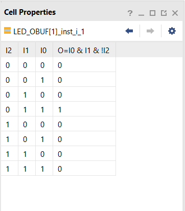

# LotsOfGates
Vivado turns all circuits into the primitives of a CLB Slice: LUTs, muxes, carry-logic, xor gates, d flip flops. Understanding these is the goal of this course. We have covered XOR gates.  The goal of this lab is to understand LUTs. 

The goal here is to predict [LookUpTables](https://en.wikipedia.org/wiki/Lookup_table) (LUTS) values.
Then find their contents in Vivado and compare.
Then look at how Vivado deals with identical circuits. 

## Project_1

Below is a diagram of a circuit with two outputs. The outputs are identical. The bottom part with two input gates reduces to the top circuit of one three input Nand gate. The circuit was built in  [logisim](https://sourceforge.net/projects/circuit/) which is a java runtime program free to download. The logisim circuit called [two identical circuits](https://github.com/ENES-246DigitalElectronics/ENES246/blob/master/-4LotsOfGates/TwoIdenticalCircuits.circ), can also be downloaded.  The top circuit uses one gate. The bottom circuit uses 5 gates.  The question is what does Vivado do with these circuits?

#### Port Diagram

#### Verilog Code

#### RTL Schematic Screen shot

#### Synthesis Schematic Screen shot

#### Implementation Device screen shot zoomed in on something interesting

Both outputs shown, found with different LUT chips

#### Testing

Throw switches, output should be high when any switch is off

One might expect that Vivado would reduce these to a single circuit and reuse the circuit. There have been software packages that do this.  The logisim software can do this. Download logisim and the circuit above, and with this circuit open in logisim, go to project, analyze the circuit, minimize, set as expression for output x, set as expression for output y, ok, yes sure. *What happens?*

both circuits are simplified to fewest gates, yet they are not combined.

*Add screen shot of logisim of the resulting circuit.*  

Now explore what Vivado does in your screen shots above. Clearly Vivado could see two identical circuits. *What does Vivado do instead?*

​	It switches the order of the inputs, making the two truth tables not equivalent, even though they are equivalent relative to the switches. It also combines some of the logic, like sw0 & sw1, where the output from one and gate is used twice.

To see Vivado LUT's truth tables, click on schematic, right click on the LUT and choose cell properties, move the tab from General to truth table. *Add screen shots of the Vivado LUT truth tables.* 

Obviously Vivado understands the verilog code. *How are the truth tables the same?* 

 They have one true statement when two of the inputs are true, and no other true statements

*How are the truth tables different? What did Vivado do to make the circuits different?* 

The inputs are switched around, i2 and i3 are swapped, making the tables look different, but function the same.

## Project_2

Repeat project_1 with your own design. Develop two identical circuits. Build the first circuit with 3 inputs, 2 outputs and at least 5 gates. The second circuit can be a simple version of the first.  Then repeat the instructions of project 1.  Document your circuit with the port diagram and screen shots. 

#### Port Diagram

#### Verilog Code

#### RTL Schematic Screen shot

#### Synthesis Schematic Screen shot

#### Implementation Device screen shot zoomed in on something interesting

L16(The irrelevant variable ) compared to an inactive switch. Verilog removed L16 from the circuit, yet still has some sort of difference between this and the other switch.

#### Testing

*Is anything different?* 

Verilog did get rid of useless variables, but still did not combine  the two outputs with a single logic source. Verilog still  used two LUTs

# Ethics of choosing which Algorithms to Teach

You are student at a university. *Why would professors demand in the first course on digital circuit design that you learn  [Karnaugh Maps,](https://en.wikipedia.org/wiki/Karnaugh_map)  [Quine McCluskey Algorithm](https://en.wikipedia.org/wiki/Quine%E2%80%93McCluskey_algorithm), and  [Petrick Cover](https://en.wikipedia.org/wiki/Petrick%27s_method), which seems unrelated to the labs, doesn't predict Vivado behavior and is at best buried in the Vivado software?*

These classes explain the fundamentals of solving problems in a way students can understand easier. Newer methods such as  FPGA built on these ideas and created a different path to get the same results. This can be an "easier" reference to understand Vivado's internal processes.

​	

Suppose you are engineer designing the Vivado software. You get the question from a customer, a fellow engineer using your companies product and paying your salary: "Why doesn't Vivado see one circuit?" Read this [forum post](https://forums.xilinx.com/t5/Synthesis/Question-about-LUT-usage-in-a-very-very-simple-combinatorial/td-p/221143).  *What is your answer to this question?*   

The software is designed to create the fastest solution to the problem as fast as possible. Because the software doesn't need to combine the circuits due to space, and a combined circuit wouldn't be faster, Vivado chooses not to combine it.

​	

Engineers develop conspiracy theories when trying to predict the future. *Given the above chaos discovered in Vivado while doing the labs above, what do you expect to happen as you try to cram larger and larger circuits into an FPGA?* 

The FPGA will get better and better at creating more efficient solutions