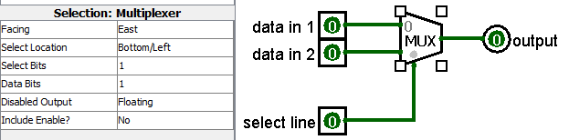

# MuxOfMux

#### A LUT is a crippled Mux

Transistors,  voltage controlled buffers, or NAND gates can be used to build an entire computer. So can a **Mux**. **Mux** stands for [multiplexer](https://en.wikipedia.org/wiki/Multiplexer). A multiplexer is like the parent selecting which kid gets to play with the toy while other kids wait. A LUT is like a **mux** with the kids desires (the truth table) frozen in time (lNIT)  and with the parent being the wires into the LUT; selecting the row of the truth table. A **Mux** lets an input wire form the response to a row in truth table to other wires selecting that row. 

#### Digital Design Goal: See the Control Path and Data Path

Digital designers look at a circuit and first see wires. Then they identify the **control** wires or **data** wires. They trace the wires in their minds and the meaning of the information in them to create **paths**.  The paths are called **control paths** and **data paths** through the circuit logic. 

A Mux select line is **control**led. The select line(s) select the one or zero of a single **data** wire. There may be 64 **data** wires attached to a mux for the select lines to choose among.

Think of the **control** path as opening or closing a water pipe's valve. A BJT [transistor](https://en.wikipedia.org/wiki/Transistor#Bipolar_junction_transistor_(BJT)) has a wire called the "base" which **control**s the **data** flow between an input called collector and output called emitter.  A FET transistor has a wire called "gate" which **control**s the **data** flow between an input called Source and output called Drain.  Transistors are used to build [NAND](https://en.wikipedia.org/wiki/NAND_gate)  gates. 

A [voltage controlled buffer](https://en.wikipedia.org/wiki/Digital_buffer#Tri-State_Digital_Buffer) has a wire called **control** that connects or disconnects a **data** input to an **output**. A voltage **control**led buffer is a generic transistor. The not version of a voltage **control**led buffer can be used to create a NAND gate:

An AND gate can be thought of as a switch. Think of one of the two inputs as the **control**. Think of the other input as **data**. The **data** only gets through if the **control** is a one.  A NAND gate operates in a similar fashion and can be used to build a mux. 

A NAND, voltage **control**led buffer, and transistor all share the same three port interface.

#### Primitive Mux has 4 port diagram

The most simple **mux** has a four port diagram: 

The above 4 port diagram contains a mux built with [voltage controlled buffers](https://github.com/ENES-246DigitalElectronics/ENES246/blob/master/-5MuxOfMux/muxFromVoltageControlledBuffers.circ).  This one shows one built with [gates](https://github.com/ENES-246DigitalElectronics/ENES246/blob/master/-5MuxOfMux/muxFromGates.circ):

Simple circuits or symbols displaying what the circuit does can be put inside a port diagram. But some port diagrams are composed of 100's of circuits, making them too complicated to put in the port diagram box. So port diagrams can be empty. 

A mux circuit symbol is a triangle with the nose chopped off. The big flat side of the triangle has all the data inputs. The chopped off nose has the the data outputs. Control  wires are attached to the sides of the triangle.  Often the output of a mux turns into control for another circuit. 

A port diagram of a Carray Chain Block is below. The dashed line outlines the port diagram. There are arrow heads that describe inputs and outputs.  The insides of the port diagram represents a carry logic path control path. Inside the port diagram are muxes and xor gates. 

The data inputs are on the left and outputs are on the right. Control starts off as data going left to right and then turns a corner and moves from bottom to top. This can actually be seen physically inside the FPGA's  [fast_carry_logic_path](https://www.xilinx.com/support/documentation/user_guides/ug474_7Series_CLB.pdf):

The carry of "fast carry logic" is exactly the same carry concept taught in elementary math. Any math operation or comparison (greater than, less than, equal to, not) results in carries. Carries are control lines. Carries limit the speed at which circuits can do math. Many control lines have to be co-ordinated. Clocks enable coordination among multiple control lines. This clocked coordination is what results in a physical FPGA geometry.  

#### Everything is a Mux

Almost all other boxes you see in a building wiring closet, mainframe shop or IT center with many wires attached are one form or another of a mux. The data coming in can be analog or digital. The control is always digital. The control can look at the data coming in and control based upon whether it is streaming video, compressed video, text/graphics, keyboard/mouse, file transfer, etc.  They have different types of data paths and different control mechanisms. They have names like [stat mux](https://en.wikipedia.org/wiki/Statistical_time-division_multiplexing), [Front-End Processors](https://en.wikipedia.org/wiki/Front-end_processor) , [MAUs](https://en.wikipedia.org/wiki/Media_access_unit),  Switches, Bridges, etc. Today they have all turned into routers of the IP protocol. 

#### Modules

The lab goal is to find Verilog code that uses the muxes of the FPGA  and then use them to build larger and larger muxes using Verilog modules. 

You have already seen modules used in Verilog code. They look like functions.  They consist of a module name, a module instantiation name, and a list of wires in parenthesizes. Below the m2x1Mux module is instantiated three times:

You have already seen modules defined in verilog code through the module, endmodule construct. Below is the verilog code for the m2x1Mux module:

Top level module m4x2Mux.v sends wire names (m2x1muxcOuta, m2x1muxOutb, select[1] and segOut to I3 instantiation of m2x1Mux which maps them respectively to a, b, select, f.  The order of wire names in I3 of (m2x1muxOutA, m2x1muxOutb,select[1],segOut) and the order of module m2x1Mux (a,b,select,f) means wire a is tied to mx2xmuxOuta .... segOut is tied to f. Ordering the list of wires so they match up becomes very difficult in large projects. To reduce mistakes, a more complicated  [port mapping by name](https://www.vlsifacts.com/port-mapping-for-module-instantiation-in-verilog/) alternative has been developed, but will not be used in this course.

You can see that m2x1Mux refers to primitive (built in to Verilog) modules called not, and, or. The modules not, and, or .... can not be seen. They are invisible. This is why they are called [verilog primitives](http://www.asic-world.com/verilog/gate1.html). 

#### Top Level Module

A top level module gets its inputs and sends its outputs to the constraints or XDC file. Modules that are not top level can trace all their inputs and outputs back to the top level module.  There may be intermediary modules in between.  Vivado automatically determines the top level module by checking variable names. 

#### Always use different wire names in the XDC file than the defaults

Here is the XDC file for the project m4x2Mux:

SW[3:0] has been renamed b[3:0]. SW[5:4] has been renamed select[1:0]. LED[0] has been renamed segOut.

This is best practice. This is because any top level, end of project module could instantly loose it's status and another module be put on top of it. The goal is to change nothing about the modules used including wire names.  This way the tested module can be retested in the future when debugging what is going wrong.

#### No Top Level Module

When there is just one module, Vivado sometimes complains that there is no top level module.   A top level module has a special symbol put their automatically by Vivado. It looks like a tiny pyramid of three squares with the top one being green and bottom two gray in Vivado 2018.3 defaults. 

#### XDC file should be in the project

For the purposes of this class, all Vivado projects should be standalone. In big projects, this is not true. For this class, all modules should have their own constraints XDC file so they can be manually tested with the contents of just one folder downloaded. This means that XDC files need to be within the Vivado project folder.  Below are screen shots of before and after a "Copy ALL Files into Project" has been done. 

Modules that are built on top of more primitive modules have their own constraints XDC different than the primitive modules.  This means that all Vivado projects should have one XDC file.  Complex projects use many constraint files and are automatically tested.  How to manage multiple constraint files is a future topic. 

