[The Manual with Examples](https://www.xilinx.com/support/documentation/sw_manuals/xilinx2018_3/ug901-vivado-synthesis.pdf)

[The starting point or hub of all Xilinx Manuals](https://www.xilinx.com/support/documentation-navigation/design-hubs/dh0018-vivado-synthesis-hub.html)

# Testing with 2nd Circuit & Truth Tables 

The 16x4 mux of the previous lab can be tested with a circuit called a decoder.  Download logisim circuit of this testing possibility.

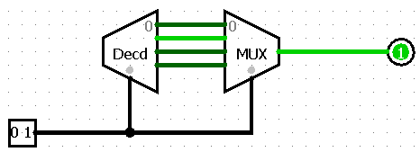

To implement this we need to first build a decoder circuit.

## 1decoder

#### Port Diagram

#### Verilog Code

module decoder(
    input [3:0] select,
    output [15:0] LED
    );
    assign LED = 1 << select;
    
endmodule

#### RTL Schematic Screen shot

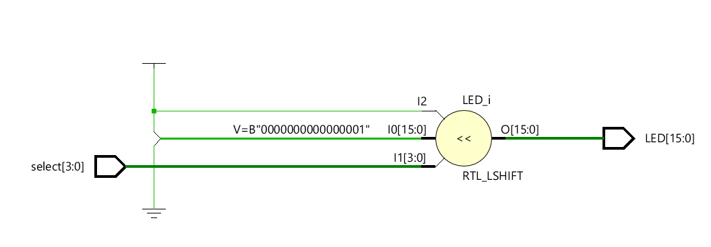

#### Synthesis Schematic Screen shot

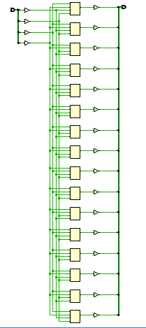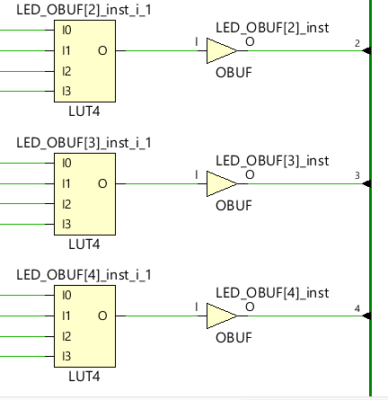

#### Implementation Device screen shot zoomed in on something interesting

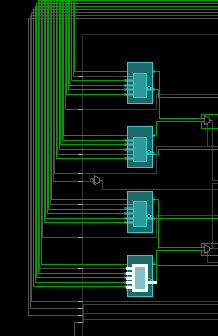

All of these LUTs are titled LUT 4 despite being shown as different parts, maybe name is defined by the operations used, and all of the Luts have identical operations.

#### Testing

The inputs SW[0] to SW[3] should be treated as binary numbers, where the output is LED[x]  where x is the base 10 equivalent of the binary number, test by throwing switches by counting in binary.

#### Prompts

*How many of the outputs of the Decoder are positive at any given instant in time?*

Ideally one

*When the Decoder changes it's output, what happens among these choices:*

  1. *Do all outputs go to 0 before the next set of outputs are displayed?* 

     

  2. *Do the new 1(s) appear along with the previous 1(s) simultaneously?*

  3. *Does/Do the output(s) flicker in some unknown way based on impurities or differences in the fabric of the FPGA?* No they should be driven as 0 based on the LUT truth table

  4. *Do we have the tools to figure out what the answer is?*	No Vivado shows the truth table outputs for the LUTS, but finding what happens in the infinitesimal amount of time during switches is difficult, maybe using a oscilloscope.

*Given the concept of an [infinitesimal](https://en.wikipedia.org/wiki/Infinitesimal), is it ever possible for two outputs, from any circuit to change simultaneously?*

No, any two things cannot happen perfectly simultaneous, the differences can only be reduced to unnoticeable amounts.

## 2dec-mux-nothing

#### Port Diagram

#### Verilog Code

module decoderToMuxTest(
    input [3:0] select,
    output q
    );
    wire [15:0] inBetween;
    
    assign inBetween = 1 << select;
    assign q = inBetween[select];

endmodule

#### RTL Schematic Screen shot

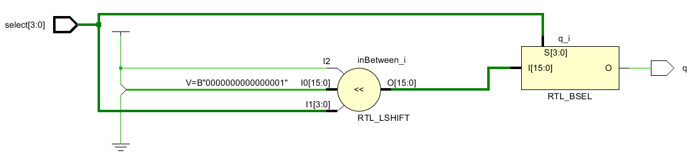

#### Synthesis Schematic Screen shot

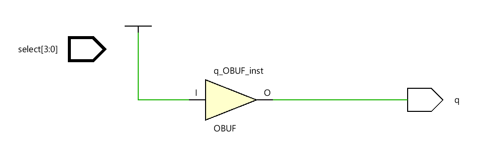

#### Implementation Device screen shot zoomed in on something interesting

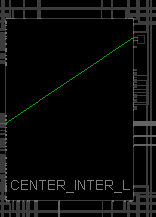 This device outputs a logical 1, and shows the simplification of this circuit

#### Testing

LED should be on regardless of inputs

#### Prompts

*Does this circuit work, or is the testing trivial?*

Testing is trivial, LED should always be on

*At what stage in the workflow does the vivado decide this circuit is a mistake, it is trivial and doesn't implement it?* Synthesis is when the schematic is simplified to always high

*Do you think it is [possible to turn off some aspect of Vivado](https://forums.xilinx.com/t5/Implementation/How-to-disable-optimization-in-vivado/td-p/770861) that would enable testing of this circuit?*

*What is the easiest, obvious starting point to explore options in Vivado to turn off anything that it does?*

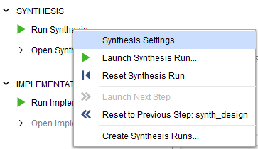

*What synthesis properties (right mouse click on Run Synthesis, choose Synthesis settings) could be tried to turn off circuit optimization ... just from reading the names of the properties?*

*If the decoder was built in one Nexys4DDR board and a mux was built in another Nexys4DDR board, and output wires from one were connected to input wires on the other (rather than LED's and SWITCHES), how many wires would be needed?*

## 3dec-mux

Maybe the reason that Vivado optimized the decoder and multiplexer out of the circuit was because the wires or nets between the decoder and multiplexer were optimized out. 

#### Port Diagram

#### Verilog Code

module decoderToMuxTest(
    input [2:0] select,
    output [7:0] LED,
    output muxOut
    );
    wire [7:0] inBetween;
    
    assign muxOut = inBetween[select];
    assign inBetween = 1 << select;
    assign LED = inBetween;

endmodule

#### RTL Schematic Screen shot

#### Synthesis Schematic Screen shot

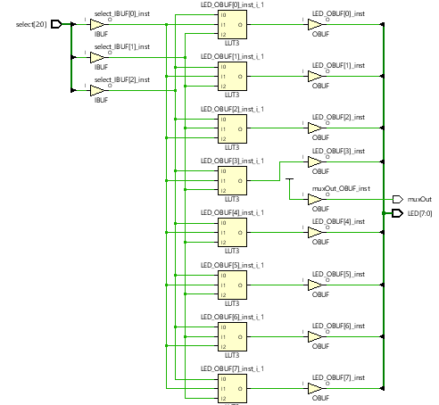

#### Implementation Device screen shot zoomed in on something interesting

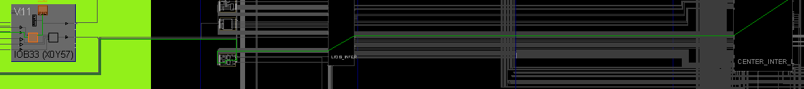LED[15] written as 1

#### Testing

#### Prompts

*Did this circuit fix the problems of the previous circuit?*

No the circuit was still simplified despite the intermediate steps taken

*Did this circuit test the decoder?*

Yes it showed the decoder outputs as a set of LEDS

*Did this circuit test the mux?*

No the Mux was once again simplified out of the circuit.

# Ethics of Testing

Vivado supports **VHDL** or **System Verilog** for testing. See the Run Simulation tab. In general, no engineer is happy with these tools. Some Verilog engineers began using VHDL rather than System Verilog for testing. 

There are commands that run in Vivado "Run Simulation" yet cause error messages in RTL Analysis, Synthesis, or Implementation. These are called [Verilog Constructs Not Supported in Synthesis](https://www.google.com/search?q=verilog+Constructs+Not+Supported+in+Synthesis&rlz=1C1CHBF_enUS809US809&oq=verilog+Constructs+Not+Supported+in+Synthesis&aqs=chrome..69i57.1895j0j7&sourceid=chrome&ie=UTF-8).  The problem is that there are no standards, and different FPGA vendors Synthesize a different subset of Verilog commands. 

Some engineers built their own testing framework outside of Vivado in languages such as [python](https://forums.xilinx.com/t5/Simulation-and-Verification/cocotb-Anyone-hear-of-it/td-p/837551). Today testing distinguishes digital design companies.  These companies (and their engineers) compete with in-house designed test tools (software). Time is money. The more efficient your testing, the lower your engineering design costs. The commercial world, by itself, has no incentive to Standardized Testing. 

There are many companies and open source products ([EDAplayground](https://www.edaplayground.com/)) that stop after simulation testing.  Using one of these tools can falsely make you think that there are testing standards. It falsely makes the education community think that after passing a simulation test, the physical implementation in FPGA vendors hardware will work.  But code that passed simulation testing, often **fails**. 

Vivado describes some does and don'ts in [ch3](https://www.xilinx.com/support/documentation/sw_manuals/xilinx2016_3/ug901-vivado-synthesis.pdf) of this pdf for all HDL languages, not specifically Verilog. So the [catch22](https://en.wikipedia.org/wiki/Catch-22_(logic)) is having to know verilog well enough to read this chapter to know what part of Verilog not to use.  

## Testing with second test circuit

Putting a special test circuit in the FPGA along with the primary circuit is possible without any special tools. This is why there was no clear boundary between the original, 1980's verilog used for testing during simulation and verilog used for building circuits.

## Testing with data collected in FPGA's RAM

In the 1980's it was easy to purchase a logic analyzer. They were expensive and ran faster than any circuit you wanted to test. They had voltage probes that could spy on what was going on inside any wire/net of the circuit. They had probes that could replace any chip and look at the rest of the circuit from that chips point of view. You could program the logic analyzer to behave as that chip .. to see what was working and not working. 

The biggest logic analyzers were custom built for a circuit. They had probes for every net/wire in the circuit. There were so many wires, 24 gauge wire cross sections could fill up more than a foot square space, take  200 man hours to physically wire up, and a fork lift to move.  Today the market for the  [voltage probes](https://ect-cpg.com/welcome) still exists, but they are just checking circuit boards at various stages in the manufacturing process. They are not connected to a logic analyzer. They are connected to a computer that checks connectivity.

Now the circuits run faster than any external piece of equipment with logic probes attached to the circuit.  But all is not lost. 

Vivado allows you to place virtual logic probes inside your FPGA with an Xilinx intellectual property (IP) core called  [ILA](https://www.xilinx.com/support/documentation/sw_manuals/xilinx2015_4/ug936-vivado-tutorial-programming-debugging.pdf) "Integrated Logic Analyzer." Data collected from ILA logic probes is stored in the FPGA and analyzed after the real circuit is physically operated. 

*What is the best way to teach a digital design course when most of the verilog code, advice and guides found on the internet seem inconsistent, contradictory, and generate nothing but error messages?*

*What is a solution to the internet collecting bad, not-modern, misleading, not-useful verilog code?*  

*How is root cause of this verilog chaos related to testing?* 

*What solutions do you predict will emerge from the [DARPA Electronics Resurgence Initiative](https://www.darpa.mil/news-events/2018-07-24a)?* 

*How will this impact your career?* 

*How will it impact this course?*