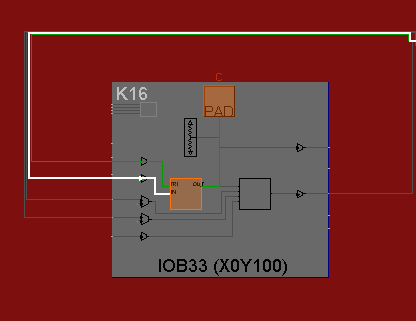
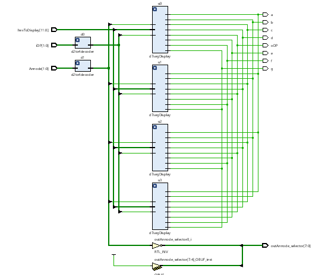
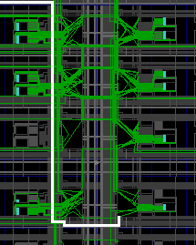

You have tested a Voltage Controlled Buffer VCB in Lab 2.

You have built muxes in Lab 5

Now is the time to start putting all these pieces together in a larger project. 

# 1_SevenSegDisplays

The goal of this project is to manually explore how a 7 seg Display works. You just need to shoot screen shots and test.

#### Port Diagram

#### Verilog Code

#### RTL Schematic Screen shot

#### Synthesis Schematic Screen shot

#### Implementation Device screen shot zoomed in on something interesting

#### Testing

## 2 _HexTo7SegDisplay

Here the goal is to explore how to display Hex on a 7 Seg Display. The problem is how to display 10,11,12,13,14,15 which are possible with 4 switches. 

There is some logic behind this code. Look at the equation for seg(6) or g. Only three numbers turn off  segment g: **0, 1 or 7**,  **0001 or 0111**, (**~x[3] & ~x[2] & ~x[1]** ) |(**x[2] & x[1] & x[0]** ). 

Is this obvious to a electrical or computer engineer working in the field?  **Yes.** 

10 in hex is a. 11 in hex is b. 12 in hex is c. 13 in hex is d. 14 in hex is E and 15 in hex is F.
*Modify this project so that the above characters are Propose assign statements for these 6 displays for the letters of hex in a manner similar to the way 0,1,23,4,5,6,7,8 and 9 are displayed.* 

#### Port Diagram

   for get this ... there should have been a port diagram for this project 

#### Verilog Code

   paste your modified code here

#### RTL Schematic Screen shot

  make this of your modified code

#### Synthesis Schematic Screen shot

  make this of your modified code

#### Implementation Device screen shot zoomed in on something interesting

  make this of your modified code

#### Testing

testing the modified and unmodified should be the same

## 3_d7SegDisplay

#### Port Diagram 

xxxxx don't try to draw xxxxxx

#### Verilog Code

#### RTL Schematic Screen shot

#### Synthesis Schematic Screen shot

***Implementation Device screen shot zoomed in on something interesting***

 This shows one of the segments used in the code, implemented with a tristate.

#### 

#### Testing

Nothing should happen without sw5 thrown, afterwards, the first 4 switches are converted to hex and shown on the LED display, and the sw4 represents the decimal at the bottom right of the LED.

Throw switches to count up from zero, with and without sw5 thrown, to prove the above result.

------

#### Prompts

*Can you explain how this spreadsheet was formed and it's relationship to the code above?*

*In this lab there is another folder named 7SEG. Find the code that does something similar and shoot a screen shot of it here.* 

*Discuss the pros and cons of all three and pick one of them.*

## 4_d4x7segDisplay

#### Port Diagram

xxxxx don't try to draw xxxxxx

#### Verilog Code

#### RTL Schematic Screen shot

#### Synthesis Schematic Screen shot

#### Implementation Device screen shot zoomed in on something interesting

#### Testing

------

#### Prompts

This really shouldn't be called 4 segment displays. *How many displays does it really use?*

It uses one at a time, two of which aren't even independent 

[Resource Utilization](https://forums.xilinx.com/t5/Implementation/Vivado-utilization-report/td-p/317517) forum question and answer.  Read this and do a screen shot of resource utilization of the last project above, so when this project is finished they can be compared.

## 5_32bitsHexTo7seg

This is working! Goal is to figure out how to use it in future labs.

#### Port Diagram

#### Verilog Code

#### RTL Schematic Screen shot 

#### Synthesis Schematic Screen shot

#### Implementation Device screen shot zoomed in on something interesting

 Lots of stuff going on

Lot more flip flops being used to count, remember things.

------

#### Testing

Left most switch[15]  pauses the counting.
Switch[14] resets to 0, pausing on a random segment
Switches 0 through 2 control the decimal place. 

------

#### Prompts

*What does the utilization report look like?*

*Which* *counter would you delete if another program was controlling the number to be displayed? Cut and paste a picture of the code that would be deleted in order to do this.*

*What 32 bit variable name that you would add as an input to this module, and connect it to a top level with something to display? (Hint right now it is seeded with a constant.)* c_input

*Are clk, reset, stop_start, count_clk, divider_counter needed if the counter clock is removed?* clk is still needed. Everything else will not be mentioned in the code if the counter clock is removed. 

*What will have to be changed if the 32 bit Hex to BCD code is added?* c_input will be feed into the hex to BCD circuit, the output of the circuit will require modification of the //hex selector circuit, replacing c_input. 

*What variable controls how fast the counting is done?* divide_counter.

*To slow down the counting, what would need to be done ... make the number larger or smaller?* Larger. 

*Modify the screen code shot above with red boxes around all the commands that are new to you.* 

### Ethics of Different Institutional Objectives

There are three groups of Engineers with different objectives:

1. Engineers work for vendors .. For example Engineers work to improve Xilinx hardware FPGAs and Xilinx Vivado software to use them.
2. Engineers work for commercial/defense companies. Some use Xilinx. Others use Xilinx's competition. 
3. Engineers work for educational institutions. They teach and create open source, public, free tools for their doctorate degrees. Their students build circuits with a variety of tools and don't try to be an expert at one of them. 

*Describe one area where these three different institutions conflict.* 

*Describe where the FPGA companies like Xilinx and the open source world conflict.*

*In what way are engineers removed from their employer's competing goals and more free to work together in standards committees?*

*What does an engineer represent ... like a lawyer representing clients, doctors representing patients?*

*What motivates all three groups of engineers to start cooperating and working together building a common standard such as the next version of Verilog?*

*Why has the [US supreme court](https://supreme.justia.com/cases/federal/us/435/679/) ruled that engineers from competing companies meeting and forming organizations is not price fixing, is **not** [anti-competitive collusion](https://caselaw.findlaw.com/us-supreme-court/435/679.html)?* 

