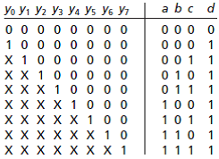

# Clocks, Counters, Slices, Priority Encoders

The first half of this course has been completed. We have created circuits using gates and RTL logic.  They all have executed at almost the **speed of light**. These circuits have various names and have been described in various ways. Memorize them:

​	Combinatory
​	Combinational
​	Boolean Equations
​	Truth Tables
​	Asynchronous

We have looked at clocks in a Test Bench. This was confusing. A clock makes no sense. We have seen ticks in Verilog code where a line starts off with #3 which means delay or **pause 3 ticks for testing logic**. 

Now we are going to look at a real clock. The ones we hear about when choosing which CPU to purchase in our laptop or desktop.  The clock is external to the FPGA. It gets in like a switch. It is turned on in the *.XDC file. Physically the clock is a [crystal inside a silver can](https://en.wikipedia.org/wiki/Crystal_oscillator) that takes a few moments to reach a steady temperature and then begins oscillating at an amazingly precise frequency.

​		

The [Nexys4 DDR board](https://reference.digilentinc.com/reference/programmable-logic/nexys-4-ddr/reference-manual) has a 100MHz crystal. Intellectual property from Xilinx (circuits from Xilinx) can increase this speed up to 450MHz and with perhaps some [jitter](https://en.wikipedia.org/wiki/Jitter) up to 650Mbps. The FPGA, memory IC, and the board itself are capable of the maximum data rate of 667Mbps.  Intel I9 processor's base speed is around 3.8GHz. Bits per second (bps) and cycles per second (Hz) are [roughly equivalent](https://electronics.stackexchange.com/questions/56265/difference-between-hz-and-bps).

## 1_clockTest

The goal of this project is see the most simple counter possible.  

#### Port Diagram

#### Verilog Code

#### 

#### RTL Schematic Screen shot

#### Synthesis Schematic Screen shot

#### Implementation Device screen shot zoomed in on something interesting

E3, or the clock chip, that looks similar to a normal swtich

#### Testing

You should uncover a bug during the test of this circuit.

___

#### Prompts

*What are the symptoms of the problem?* 

The seven seg display is changing faster than possible, so all of them are on, and the LED representing the seven seg displays are also all on, despite the rightmost LEDs properly flashing.

*There are two manual solutions to the problem. What are they?*

Turn down the clock speed to something more readable,

*Could this be considered a feature to the circuits user given that the other user is probably another circuit .. ie (7segDriver) ?*

*Could the "waiting" required be blamed on some complexity of the circuit?*

*Is this a problem of verilog logic, vivado synthesis or implementation, or a more traditional algorithm problem of a C++ or Java Class?* traditional algorithm problem of a C++ or Java Class.

*The problem is associated with freezing, counting fast and counting slow. What line numbers in the code are associated with this?* 

*Given multiple solutions and one symptom, does this imply multiple problems or one problem?*

*What is the problem?*

# 2_bitSlicing

The goal  is to find a way to grab 4 bits out a group of 32 in a single line of code.  This technique is called bit slicing.  This is similar to slice or split in other languages.  This is used in two places in the 7seg display code: "hex" selector and  "hex to BCD" convert.

#### Port Diagram

#### Verilog Code

#### RTL Schematic Screen shot

#### Synthesis Schematic Screen shot

#### Implementation Device screen shot zoomed in on something interesting

Strange components that signals randomly interact with

#### Testing

3 Select bits select 1 of 8, 4 bit groups from a 32 bit constant and display on LEDs.  The constant is inside the port diagram:

------

#### Prompts

Slicing or Slitting is part of a number of languages including  [python](https://www.programiz.com/python-programming/methods/built-in/slice) , [matlab](https://stackoverflow.com/questions/11318724/matlabs-slice-function-not-working-as-desired), [perl](https://perldoc.perl.org/functions/split.html) and is a common concept name to use when searching for something similar in other languages [C](https://stackoverflow.com/questions/14618342/copying-a-subset-of-an-array-into-another-array-array-slicing-in-c), [regular expressions](https://stackoverflow.com/questions/35578470/how-to-slice-characters-from-string-using-regex). *Is slice or split a concept or syntax in verilog*? Concept.

In the SystemVerilog standard [IEEE_Std1800-2017](https://github.com/ENES-246DigitalElectronics/ENES247/blob/master/IEEE_Std1800-2017_8299595.pdf) (released in Feb. 2018), search for "+:" . *What section, sub-section, sub-sub section ... etc. is this documented .. and how is this described?* 

1. Aggregate data types
   7.4 Packed and unpacked arrays
   7.4.3 Operations on arrays
   ​	— Reading and writing a variable slice of the array, e.g., A[x+:c] = B[y+:c]

Suppose this test didn't work. You would then go to the Xilinx's reference called [ug901-vivado-synthesis.pdf](https://github.com/ENES-246DigitalElectronics/ENES247/blob/master/ug901-vivado-synthesis.pdf) which is randomly updated.  *What page is "+:" found  that is not in the middle of code and how is it described?* 

On page 222 in Dec. 19, 2018 version of ug901 is described as  "Variable Part Selects Verilog Coding Example".

*Given that the "+:" symbol appears in Xilinx documents as well as the standard, what percentage confidence do you have that this will synthesize in Vivado?* 

90% confident .. it has worked in the past. No reason for it to stop working now.

Look at this chart describing the growth of Verilog/SystemVerilog. The 2017 standard, reportedly did not add any new functionality to the 2012 standard. *The "+:" concept is actually listed on this chart. What is it's name?*  [Variable part select](https://www.google.com/search?q=verilog+variable+part+select&rlz=1C1CHZL_enUS735US735&oq=verilog+variable+part+select)

*Given that it is part of the older Verilog standard before it merged with SystemVerilog, how confident are you now that it should work?* 100%

The 2017 standard, reportedly did not add any new functionality to the 2012 standard. *How relevant do you think [this document](http://sutherland-hdl.com/papers/2013-SNUG-SV_Synthesizable-SystemVerilog_paper.pdf) (that the graphic from above came from) is?* Very relevant

*The word "design" in the graphic above means the code will work where in the Vivado workflow? (Simulate, RTL, Synthesize, Implement, Bitstream)* Synthesize. 

*The word "verification" above means the code will work where in the Vivado workflow?* Simulate. 

*How does the IEEE_Std1800-2017 describe these two parts of SystemVerilog?* The same way.

------

# 3_priorityEncoder

A PriorityEncoder is a concept. Two applications are presented below and then some code is used to test building it in SystemVerilog and implementing it with Vivado on the Nexys 4 DDR board. It is an artifact of building digital circuits that has began evolving in 1970s. 

The goal is to eliminate the leading zero's when displaying 8 numbers on the 7seg displays of the Nexys4ddr board. The algorithm is move left to right looking for a 1 in the truth table below.  Record position (7,6,5,4,3,2,1,0) of the first digit not a one. 

The next biggest application of this is to read motor encoders. Motor encoders track the movement of a motor. The goal is to tell the motor to move a certain distance (different ways for different motors). Then see if the motor actually physically moved the far by counting a series of pulsing lights coming through a series of holes attached to the shaft of the motor. 

More generally, priority encoders are used when there are lots of inputs and you only care about just a few lines in the truth table. The rest of the input combinations you don't care about. The few lines you do need must form a pattern. That pattern has to be turned into a truth table that looks something like this:

The input ***y*** subscripts move left to right indicate a 1 0 transition needs to be found. Then the 1's position is recorded. This leaves 9 rows in the truth table, requiring 4 bits of output. However, the entire 16 rows of the truth table are not defined. This could be handled with a Case Default or an If command with an Else. However this is not best practice from a sustainability point of view.  The code get's longer and longer and doesn't synthesize well. 

The ***d*** output can be found by **OR**ing together all the ***y***'s on a row. " This forms the output ***d*** which will be 1 in all the (2^6-9=247) ***X*** don't care rows. Then create a loop that looks first at ***y0***. Initially ***abc ***is 000.  If ***y0*** is a 1 then ***abc*** stays =000. Then it goes to the next row. If y1 is a 1, then ***abc***=1 and  Y0's information is overwritten because it is now a don't care ***X***.  If there is another ***y?=1*** to the right, it will be found and it's previous position will over write the previous ***abc***. 

More generally this is called priority logic.  It was the subject of a talk at the [Vivado 2015 users group meeting in Paris](https://www.xilinx.com/publications/prod_mktg/club_vivado/presentation-2015/paris/Xilinx-AdvancedSynthesis.pdf). 

#### Port Diagram

#### Verilog Code

#### RTL Schematic Screen shot

#### Synthesis Schematic Screen shot

#### Implementation Device screen shot zoomed in on something interesting

Lut along with a wire passing by unused chips with xor gates

#### Testing

the priority encoder is one of the most difficult concepts to synthesize and implement. The casez command is obviously easier to understand than the for loop. In the end they are implemented with the same number of resources. But there is a difference in the synthesis schematic. *Describe this.*

*VHDL is the alternative to Verilog. VHDL case statements are required to have no overlap. VHDL case commands can not be used to build a priority encoder. If commands have to be used. Find a URL reference to this and link it up here.*

Verilog case statements can overlap. *What does this mean? Write some code that would test this. (You don't have to make a project out of it)*

------

# 4_7segWithZeroBlank

The code for the 7 seg display is evolving.

#### Port Diagram

#### Verilog Code

#### RTL Schematic Screen shot

#### Synthesis Schematic Screen shot

#### Implementation Device screen shot zoomed in on something interesting

each of these blue squares represent an individual LUT 

#### Testing

sw 0-2 should simply move the decimal place, with the off displays not using the decimal place, test by throwing and comparing where the decimal place moves.

sw15 pauses the clock and the seven segment displays, test by throwing

sw14 resets all displays to zero, test by throwing

sw13 switches the counter form the hex counter to the decimal counter, test by throwing

the LEDs should be the binary representation of four of the seven seg displays, test this by pausing the clock and comparing the numbers

sw12 should swap between slow and fast counting, as well as which four displays are shown by the LEDS

OFF should count fast, and represent the leftmost seven segment displays, While ON should count slow and represent the rightmost displays with the LEDS. Test this by throwing the switch and pausing the clock with sw15

------

#### Prompts

## 5_clockUsing7segDisplay

#### Port Diagram

Just do a screen shot of the top level module.

#### Verilog Code

Top level creates the second module, creates the necessary values and variables for the second module to run, and lastly how fast the numbers count on the clock.

The second module is what runs the counting portion

#### RTL Schematic Screen shot

#### Implementation Device screen shot zoomed in on something interesting

 ALL used LUTS with a global logical 0 highlighted

#### Testing

------

#### Prompts

*Screen shot the "Report Utilization" for this project. Compare with the project above.*

*Look at the code constructs and the RTL schematic screen shot. How many gates do you see?*

*What are the indications that this is written at a behavioral level, C language like level?*

*Where would you switch to case to improve readability?*

*Putting too much on one line may be a problem. What would you suggest to improve readability?*

*How are the modules called differently in the top level module compared with the project above?*

*Look through the messages, starting with errors, very important, ... What are some errors that concern you, that we should be addressing?*

# Next Steps

Improve readability of the module.

Add "split" feature that does zero blanking on the right 4 segments separately from the left 4 segments so two numbers could be displayed simultaneously.

Combine the "split" and "BCD" feature so that both the left and the right can be switched from binary to BCD.

Another option needs to be added that supports words being input rather than binary. Would add support for this [representation of the alphabet on a 7 seg display](https://en.wikichip.org/wiki/seven-segment_display/representing_letters). Need to think about how it would be physically implemented. Can numbers be mixed with this? Could but there are 26 + 10 or 36 which is 6 bits per segment, not 4. So has to be widened to 48 bits sent to the 7seg display with some of the most significant bits turning into letters. Some design is needed here. Zero blanking may need to be turned off. Would need to write a top level module that shows how to use it in this mode.

