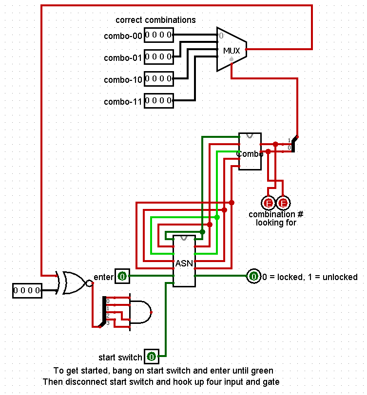
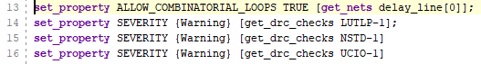
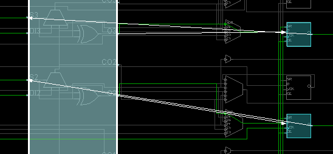
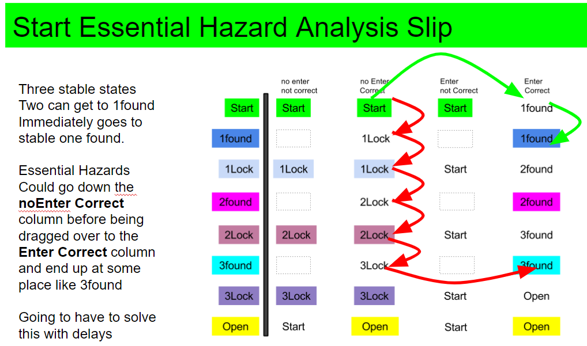

# Latches

 Why? Latches are evil we know this.

We know that Vivado associates latches with not completely specifying all the cases or covering all if possibilities. It is associated with remembering a default state just in case it is needed.

But this is not the only evil latches contain. After understanding this evil, we can move back into the Vivado world with the additional intuition about  how circuits "remember."

## 1_SR_Latch

#### Port Interface = RTL Schematic

#### Synthesis Schematic

Implemented with LUTS! Clearly there is going to be delay thru LUT3 that is going to cause a glitch or bounce on Qbar.  It is going to happen so fast that we will not be able to see it. 

#### Something Interesting on the Device Window

What is interesting is one of the LUTs has three inputs. Looking at the inputs, one is a **loop** of it's own output! Can see this in the RTL schematic also. The top LUT gets input from only one of the pads and an output of the bottom LUT! Click on wires to make them white. 

#### Test/Demo

Initially LED0 should be lit up

Throw SW[1] and SW[0] so that only one is on at a time, the output should change to the corresponding switch that is thrown. Nothing should change when both switches are off.

When both switches are on at the same time, all outputs will go off.

If the outputs are both on at any point, an error has occurred.

#### Prompts

*What gate(s) does the LUT2 truth table (look at the equation) represent?*  An nor gate

*What gate(s) does the LUT3 truth table (look at the equation) represent?* A complicated mess. 

*What feature or pattern in the LUT3 truth table prevents an oscillation, prevents the output feeding back to the input, changing the output again, changing the input again?*

I1 = Out

Notice that replacing I1 with Out in any given situation will not change Out (IE the last row I1 and Out do not match, if you replace I1 with Out(which is a logical low) you get row 5, which also has Out as a logical low )

*Click Run Simulation. What are the options?  Type them or insert a screen shot.* 

*Click on the top option, Behavioral Simulation. What new command appears in the top, horizontal ribbon bar?* Run

*Does "Open Synthesized Design" cause a new option on the top level ribbon?* No.
*Does "Open Implemented Design" cause a new option on the top level ribbon?* No.

*What changes on the second to the top ribbon?* 

before

after

*In most software packages do you expect the top level menu bar to change .. what stimulates you into thinking that the top level menu bar changes?* 

Double click on each of the Design Unit names: 

*What new, never seen before, verilog code appears as something you can modify? Just write the name of the file.* 

*What does jtag within this verilog code tell you about it's purpose?* It is the circuit communicating through the   USB port. Hypothesis: It is sent first in the bitstream to describe that the USB port on the Nexys4DDR board is to be used to take the rest of the bit file and create a circuit when the board is physically programmed. 

Within a source code window like this one, the red dots are break points. 

*You can turn them off and on. What does a break point mean to you in other programming environments?*

*Can you still edit code?*

*Can you still mouse over to figure out why something is blue or underlined in a jagged red line?*

Re-run the simulation choosing various break points. Use zoom fit to look at what is happening.  

Or you can drag the white lines.

Reset the simulation and then run_for or step. Watch the break points. *How does the timing diagram change?*

*What is the difference between run_for and step?*

## 2_Physical SR Latch

An SR Latch is called a SET, RESET Latch. There are two outputs,  Q and Qbar. Q = ~Q ***most of the time***. 

In this lab we will physically build an SR Latch with two NOR gates:

We will be using TTL  integrated circuits called the [7400 series](https://en.wikipedia.org/wiki/7400-series_integrated_circuits).

We will be assembling the circuit on this heath kit digital trainer . Here is a [10 minute video introduction](https://www.youtube.com/watch?v=kqK9Ay4IiP8) 

 

Watch the video, [look up the chip number for a NOR gate](https://en.wikipedia.org/wiki/List_of_7400-series_integrated_circuits#Larger_footprints), find the chip in the part trays. Learn how to straighten the chip legs, how to push one row in at a time with your thumb, how to look for legs bent underneath the chip, and how to take the chip out of the breadboard with a pen or pencil. 

Wire up power. Hook switches to inputs and LED's to outputs just like Vivado does inside the FPGA. Prove to yourself the NOR gates are working on the IC (integrated circuit). Build the SR Latch.  

## Test

In your demonstration testing the SR Latch, describe the SR truth table like this: 

| S    | R    | Q    | Qbar | state description  |
| ---- | ---- | ---- | ---- | ------------------ |
| 0    | 0    | Q    | Qbar | remembering        |
| 0    | 1    | 0    | 1    | reset              |
| 1    | 0    | 1    | 0    | set                |
| 1    | 1    | 0    | 0    | point of no return |

## Prompts

The following is a sequence of events where you are to change S or R switch positions. Start with Q and Q~ remembering anything you want.  Time moves left to right. The vertical dashed lines are when you are to change input switch positions. Use  paint or some other drawing tool to edit this graphic. It is in the assets folder.

 

In the above exercise you should have become confused. Remember the rule: only one input can change at a time in a combinational, data_path type circuit. Look at these two truth tables. *What is metastable, what is invalid, what is forbidden? Why did I say "point of no return" above? You have reality in your hands. Does anything smoke? Does the trainer die? What is the grave danger?* 

Remembering is associated with the loops above. *Can the loop be really big and involve lots of chips?*

## 3_ EveryOther Clocked

This circuit is a traditional clocked, two state network. It is to be used to compare against the next circuit which is unusual and sets the stage for the rest of this lab.

#### Port Diagram

#### Verilog Code

#### RTL Schematic Screen shot

#### Synthesis Schematic Screen shot

#### Implementation Device screen shot zoomed in on something interesting

A 'clock' wire that is used as two inputs to LUTS

#### Testing

Sw 0 controls the circuti,

LED 1 and 2 count up in binary

LED 0 is the main output

Every Time SW0 goes from low to high,  LED 1 and 2 will count up

Whenever LED 1 and 2 are both low, LED 0 should also be low,

Test by throwing sw0 and observer changes.

+++++++++

#### Prompts

*How many switch up and down movements are necessary to go through all four state combinations?*

four up and down motions

*We have been taught that all nets have to have a driver. What drives the combinatory loop?*

The output of state_reg[0]

## 4_EveryOther Asynchronous Sequential

This circuit is from the [University of WaterLoo in Canada](http://pami.uwaterloo.ca/~basir/ECE124/Asynchronous_Sequential.pdf).  You should play with the [logisim](./4_EveryOtherAsynchronousSequential/EveryOtherClocked.circ) version of it first. 

#### Port Diagram

#### Verilog Code

#### RTL Schematic Screen shot

#### Synthesis Schematic Screen shot

#### Implementation Device screen shot zoomed in on something interesting

combinational loop highlighted

#### Testing

Same as above, but the Counting LEDS are LED 14 and 15,

And the SW0 will change the output every time it is changed, 

Test with same method.

___

#### Prompts

*How many switch up and down movements are necessary to go through all four state combinations?*

2 up and down motions

## 5_Combinatory Loops

What if your goal is to use Latches without initial conditions or defaults? This is what an [Asynchronous circuit](https://en.wikipedia.org/wiki/Asynchronous_circuit) or [Asynchronous  Sequential Network (ASN)](https://studylib.net/doc/8170258/chapter-13-asynchronous-sequential-network) does. It avoids clocks, works more like our brain, and stores information in loops just like the SR Latch. The IBM [TrueNorth](https://en.wikipedia.org/wiki/TrueNorth) (2014), Intel [Loihi](https://en.wikipedia.org/wiki/Intel_Loihi) (2017) and [Brainchip akida](https://www.nextplatform.com/2018/09/11/first-wave-of-spiking-neural-network-hardware-hits/) (2019) are neuromorphic CPUs that go one step further and store a 1 or 0 as a [spike](https://en.wikipedia.org/wiki/Hebbian_theory) traveling the loop.  The spikes can travel at different frequencies and potentially produce "[brain waves](https://en.wikipedia.org/wiki/Neural_oscillation)." Sleep becomes data compression and data movement from temporary to more permanent storage. 

This is the starting point for [designing radically different CPUs](https://en.wikipedia.org/wiki/Asynchronous_circuit#Asynchronous_CPU) without clocks.  CalTech designed such a CPU and it speeded up when cooled, slowed down when heated in a manner the  opposite of a reptile. The closest shipping product is a [greenarray cpu](http://www.greenarraychips.com/) programmed in [color Forth](https://en.wikipedia.org/wiki/ColorForth). 

This project is a starting point. The SR Latch above formed one combinatory loop. The goal is to design with  multiple combinatory loops to create a combination lock.

This has been done in [logism](..\ComboLockDone.circ). 

The top level module in logisim is normally called main. There is one big combinatory loop that jumps the gap between the bottom left nand gate and the ASN module input that the start switch is connected to.

Asynchronous circuits as you have seen above in the SR latch cause problems for logic simulators that are not present in the real world. Simulators and logic checkers throw lots of red because they can't find a starting point or default loop values. 

#### Testing

This circuit is difficult to test. Follow the instructions above and show your instructor it working. Learn how to set the combination, then remember it, enter it and watch the door/safe unlock. 

___

#### Prompts

There are three modules in this circuit. *What are their names? What are their port interfaces?*

*How many combinatory loops are there in this Combination Lock ASN circuit?*

The Asynchronous Sequential Network (ASN) network for the Combination Lock is impossible to **manually** test. The truth table has 7 inputs .. meaning 128 rows with 6 outputs each for a total of 768 values .. with a good percentage don't care outputs. There is no way to physically test it. Look over this [spreadsheet](https://docs.google.com/spreadsheets/d/1nGkVcBFB3kErm-xxgKJ7ydEvMWoGxCaui6ZHOyj6pJw/edit?usp=sharing). *What rows on the spreadsheet contain the truth table?*

In addition there are problems to look out for. Look through the [workflow](https://docs.google.com/presentation/d/1zx860glWQhtGzpYESTXBL64UlVK4S_J0rjW0TqCC6DU/edit?usp=sharing). On slide 7 there are a series of essential hazards found that may or may not be in the circuit.  If there are essential hazards, we can only sfoerste8296	solve them by adding delays within the combinatory loops.  There is no way to solve them in the ASN workflow! *What are the unsolved, potential essential Hazards mentioned in the workflow?*

​	Start -> 1 found may end up at 2found, 3found or open

​	Releasing Enter at 1found may end up at 1lock, 2lock or 3lock or open

​	1Lock ->2found may end up at 3 found or open

​	Going from open to start will end up at 3Lock rather than Start

The point is that ASNs are hard to design. This is because they have memory. All data path circuits up until now have had no latches, no memory and thus they are easy to design and test. *What exactly does wikipedia say supporting this (See the Asynchronous circuit link above)?* 

Vivado has created all sorts of rules that initially look like attempts to block us from attempting an ASN design. But one layer deeper, Vivado deals with this issues in the typical Von Neuman data_path, control_path, clocked world. Another layer deeper requires learning clock domains. And still one layer deeper are all the same design issues that we see in ASN. *Look through the ASN workflow and write down the names of some of the design steps:*

State Table Reduction ... Maybe One Hot solutions will eliminate this.
Stable Sates, Unstable States
Good Races, Bad Races, Lockup Races
Essential Hazards
Bounce Test
Glitch Test
Output flicker
Static Errors
Dynamic Errors

This course is going to take a detour away from ASN and into the data_path, control_path world knowing that eventually we are going to have to deal with the ASN workflow. 

## 6_WobblyRingDelays

The goal is to test adding delay lines to combinatory loops in case they show up as essential hazards in the Combo Lock below. This verilog code originating in Altera (now Intel, Xilinx, Vivado's major competitor) describes how to create a [delay in a combinatory ring](https://electronics.stackexchange.com/questions/121161/understanding-combinational-feedback-loops).  Can it work in Vivado? No. Vivado sees Combinatorial Loops and eliminates all of them, turning the project into a counter.

So putting the 'set_property in the xdc file':

Looks like the allow gets implemented during implementation, and doesn't appear in RTL schematic or Synthesis schematic. 

Adding 10 delay lines in the xdc file:

With just one delay line allowed, see bit 20 flickering. With all 10 allowed, see bit 20 flickering, meaning nothing has changed. Implementation schematic doesn't change. Since the delay is essentially a not gate, then 

may not be able to see the difference between 0 not gate delays and 100 not gate delays. So created total of 100 lines in the constraints file for each net. Received error messages. Put back to 10 delay lines, then looked for them in the Device screen. 

This is a potential loop .. does it go through the fast carry logic?

Looks like it. There are 40 of them. 

Looking at the utilization report, nothing is over 1%.  So maybe things are working. Need to setup the Vivado [Integrated Logic Analyzer (ILA)](https://www.xilinx.com/products/intellectual-property/ila.html) to see if it working by capturing some data in the FPGA's ROM. Running the program, and then looking at the ROM. Will do this after exploring intellectual property, and synchronous sequential networks, data_paths and control_paths. 

## 7_Combination Lock Verilog

This project contains an attempt at building the combination lock using three modules called: ComboLockTop, ASN and ComboCheck. ASN and ComboCheck each have separate projects to test them (or not). 

#### Port Diagram

#### Verilog Code

#### RTL Schematic Screen shot

#### Synthesis Schematic Screen shot

#### Implementation Device screen shot zoomed in on something interesting

A previously unused part of the board labeled d10, part of the ethernet section of the basic xdx file, and is not used in the xdx file, why it is active in the implemented design is unkown

#### Testing

The only way to test this is to look at the logisim screen and then the board. 

The code fails, only switching between state 0 and 2, yet outputting a switch between states 1 and 0

Origins of the error are not yet determined.

------

#### Prompts

*Create* a screen shot of all the Tcl set-_property commands that had to be added to the XDC file to get it work this much.

*Which of two essential hazards is occurring?*

*In the [essential hazards presentation](https://docs.google.com/presentation/d/1i6pWrfCM3me9zqpP_KEXsWA7gf9ua1gsaCE7vlN9VN8/edit?usp=sharing), what  graphics illustrate this?*

started at state 0, or start and ended up at state 2Lock. 

After at 2Lock, entered in the third of four combinations (currently FF), S light went on indicating that this was correct, pressed enter and ended up at start. Can not find an essential hazard for this. Need to look for it or something messed up in the  ASN logic. 

*Are there any other essential hazards?* probably

*Are there essential hazards that can be ruled out as not happening?* probably

*Might fixing one essential hazard with delays cause another that was not a problem to happen?* probably

*Do these problems have something to do with the red lines in logisim during start of the logisim simulation?* No

*What is causing these Slips?* Energy moving at the speed of light through the FPGA creating unintended glitches and spikes.

*Might there not be a solution?* yes

*Could fiddling with the delays consume years?* yes

*Won't delays slow down the Asynchronous circuit,  consume more power and essentially defeat the purpose of Asynchronous design in the first place?* Yes

*Is there a way to mathematically prove there is or is not a solution?* No

*Could there be a problem in how Xilinx implemented this circuit still?* Yes

*Why does Xilinx create so much trouble implementing latches?* Because you end up in an indeterminate mess like this.

*List off the next steps while all the issues are still on your mind.*

## NEXT STEPS

Check everything.

Get ILP working on the wobbly circuit that has delays so can see if they are working.

Start reading the ASN design documentation and get an idea of where to add delays for each of the essential hazards.

Figure out what the essential hazard is that goes from 2lock back to start rather than 3found.

Setup four or more delays using parameters and then start testing which one 

