# IP Intellectual Property
 Why? The electronic industry is filled with patents and trademarks. Income from selling FPGA hardware is not enough to pay the salaries of all the engineers involved. Patents are of circuits. Trademarks are public data (doctorate thesis's) and has been packaged in a manner that adds value. Everything is encrypted. 

For example, you need a square root routine optimized for the Xilinx FPGA. Everything you build is too slow or takes up too much of the FPGA, etc. Engineers from another company have figured out a much better square root algorithm and are offering to sell you a license to use it. This license enables you to use the encrypted IP but not see it's verilog code. 

Xilinx and other FPGA / ASCI hardware vendors help maintain this economy inside their workflow.  For example the generalized 7seg display code could be turned into an IP. This could be freely distributed within a company in a stream lined workflow. Encryption turns into something similar to a commit in GitHub .. a thing with a name that has versions that everyone uses. This could be sold to other companies. 

## 1_Nexys4DDRdemo

This is the biggest project we will get to look at in this course. This is the project that created the Nexys4DDR_Restore_Demo.bit file in the root folder of this course. There is a vivado project file in the proj folder called User_Demo. We are going to be exploring these through the prompts below. Do not jump the gun and start up the User_Demo Vivado Project File in the proj directory until prompted to below. At the end you will be asked to do a physical test. 

#### Prompts

*Open Vivado, and send the bit file in the repo root called Nexys4DDR_Restore_Demo to your Nexys4DDR board. It was created with a Vivado 2015 version. Does it still work?* *What would have to change in order for it to fail? Is the Nexys4DDR board [still in production](https://store.digilentinc.com/nexys-4-ddr-artix-7-fpga-trainer-board-recommended-for-ece-curriculum/)? Is it still in [stock at digi-key](https://www.digikey.com/product-detail/en/digilent-inc/410-292/1286-1081-ND/5117190)?* 

*Look in the 1_Nexys4DDRdemo folder.  Within it are two folders: proj and scr. Proj contains familiar contents. But a folder normally there is missing.  Which folder is it?* 

*List off the scr folder contents (or a screen shot). We are going to move through them one at a time.* 

*The scr/contraints folder looks like it contains a normal XDC file. Look at it without using vivado. It implies that other things are demoed besides LED's and switches. What are they?* 

*Which features may be used but are not described in detail (they are listed under features used) on this [web page](https://reference.digilentinc.com/learn/programmable-logic/tutorials/nexys-4-ddr-user-demo/start)?* 

*Look in the scr/hdl folder. Vivado was used for this project. Was Verilog? Was SystemVerilog? What was used for this project?*

*Look in the scr/hdl folder. This demo was split into how many modules?*

*What looks like the name of the top level module?*

*The models average 400 lines of code 157 lines estimated to be comments. Please go through each of the code blocks and fill in an [unfilled column of this spreadsheet](https://docs.google.com/spreadsheets/d/1YMxmIy6VkRc-pRICy5a5Qc_1I_HvcNle5VwgkN6bdQM/edit#gid=0). Please put your name at the top of the column.* 

*List off the src/ip folder contents (or a screen shot).*

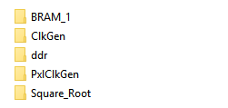

*Each IP has a vivado project, but you are locked into looking at it from what point of view?*

*We can see source code in the IP project files. We can even see them mentioned as the projects load. We can look at their contents without vivado. Do they contain anything interesting that we could use?  What do they contain?* 

*Now start up the project. What is the first screen you see?*

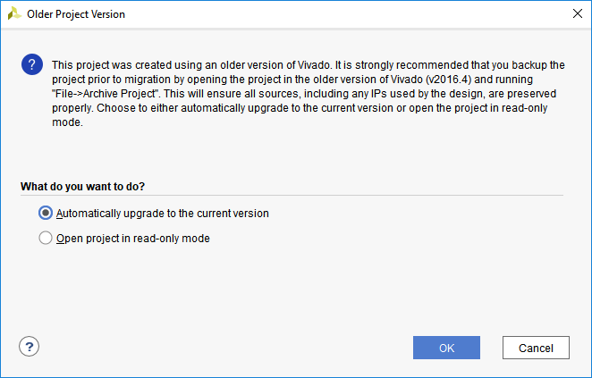

*Run the IP Status report. What does it look like?*

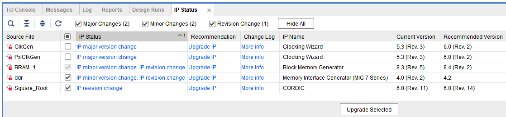

*Which IP are you required to update?* 

*After upgrading only the required IP, what message do you get?*

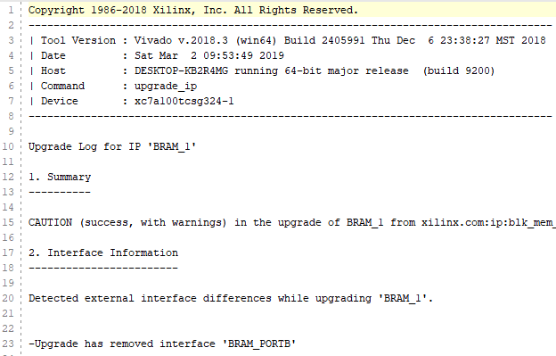

Don't be tempted to generate a bitstream. It took 30 minutes on  this computer with a solid state drive and ended with with a timing constraint warning. 

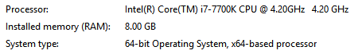

This is the device screen:

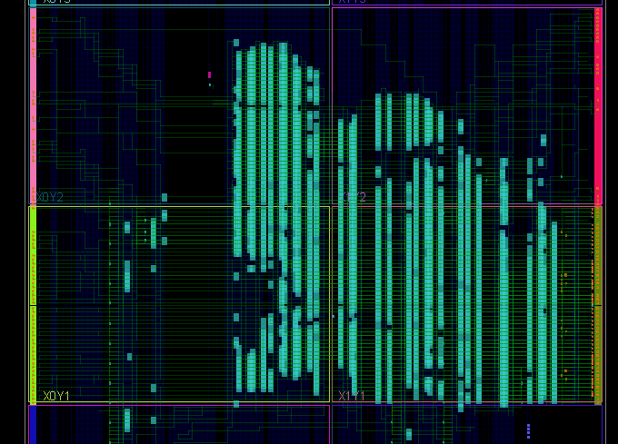

The columns are carry chains associated with math.

This is device utilization:

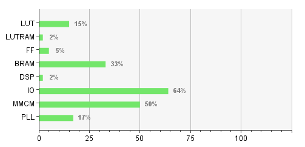

*We know what LUT means. LUTRAM and BRAM are two different types of RAM. FF stands for a d-flip flop. I/O stands for input output pads .. constraints file. What are [MMCM and PLL](https://forums.xilinx.com/t5/Welcome-Join/DCM-MMCM-and-PLL/td-p/654372)?* 

Clock management devices. The [PLL](https://en.wikipedia.org/wiki/Phase-locked_loop) is part of the MMCM. It enables better coordination among the clocks through out the circuit. One thing we are not covering in this course are clock domains which is an evolving topic and beyond the scope of this class. 

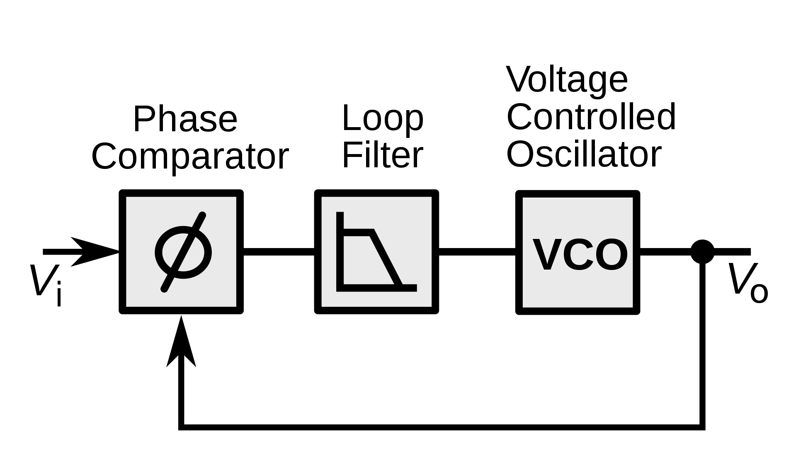

Simulation enables debugging of what is going wrong in the circuit. Have to know the output name that might exhibit the problem and input names that might cause/change/cycle through the possible causes of the problem. There is not an overall "pass" or "fall" that could be feed into a [continuous integration server](https://www.blazemeter.com/blog/jenkins-vs-other-open-source-continuous-integration-servers) in the agile development software world. 

All the simulation screens look like this post, functional, timing, synthesis, implementation, etc. The reason all of these exist is to isolate the problem in a complex design.

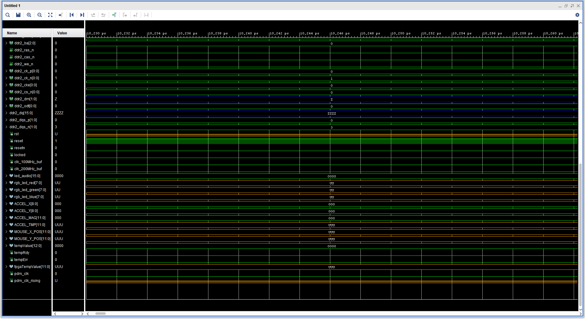

## 2_Square_Root_IP_Demo

#### Prompts

Open up a blank Vivado project.

Click on IP Catalog

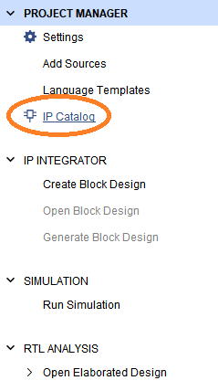

Type Sq into the search box, then click on the blue line below

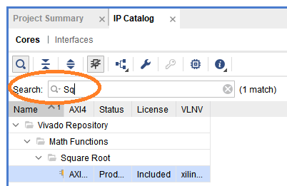

*What else besides Square Root's does this IP do*?

*This is called CORDIC version 6.0. What are we calling the graphic below?*

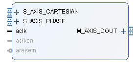

*What is CORDIC?*

From [wikipedia](https://en.wikipedia.org/wiki/CORDIC): CORDIC uses simple shift-add operations for several computing tasks such as the calculation of trigonometric, hyperbolic and logarithmic functions, real and complex multiplications, division, square-root calculation, solution of linear systems, [eigenvalue](https://en.wikipedia.org/wiki/Eigenvalue) estimation, [singular value decomposition](https://en.wikipedia.org/wiki/Singular_value_decomposition), [QR factorization](https://en.wikipedia.org/wiki/QR_factorization) and many others. As a consequence, CORDIC has been used for applications in diverse areas such as [signal](https://en.wikipedia.org/wiki/Signal_processing) and [image processing](https://en.wikipedia.org/wiki/Image_processing), [communication systems](https://en.wikipedia.org/wiki/Communication_systems), [robotics](https://en.wikipedia.org/wiki/Robotics) and [3D graphics](https://en.wikipedia.org/wiki/3D_graphics) apart from general scientific and technical computation.

So the question becomes how to use the CORDIC. *Click on Documentation. Search for square root. What do you find?* 

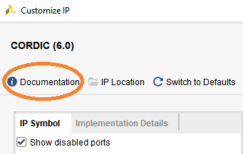

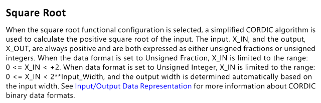

*How do I select  "Square Root Function" configuration?*

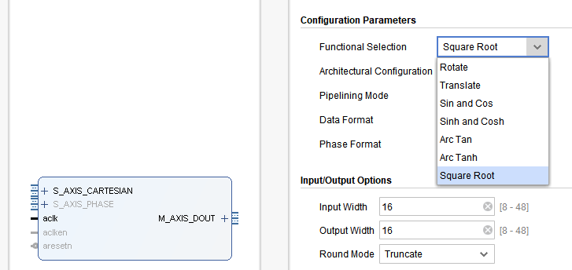

*Change the input to 32 bits and output to 32 bits so can display on the seven 7 display.*

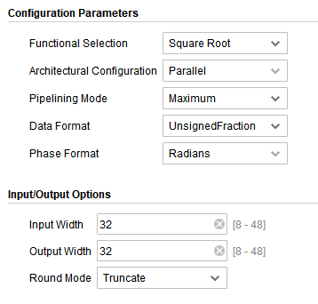

Click on OK. A window pops up describing the folder where this intellectual property is going to be stored:

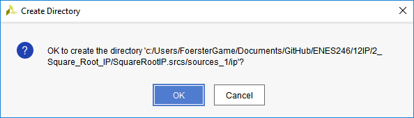

Click on OK. Then asks permission to generate output products:

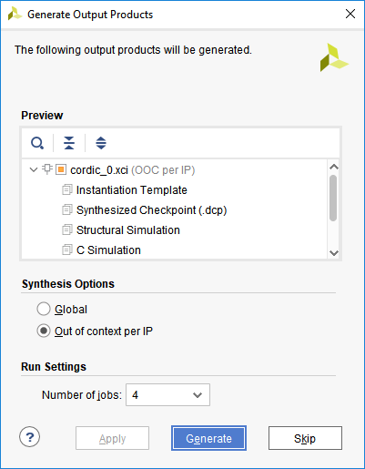

Click on generate. Then it says:

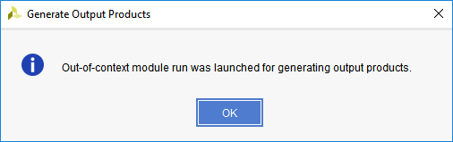

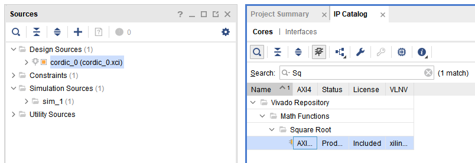

The question now is how to call this module within a top level SystemVerilog interface. Clicking on the carrot next to cordic_0, a wait symbol appeared after a while could see this:

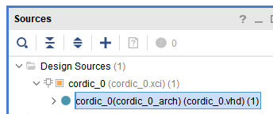

Click on this reveals the VHDL code rather than SystemVerilog code of the module named cordic_0. The input and output statements are different. But there is enough detail here to build the module in SystemVerilog:

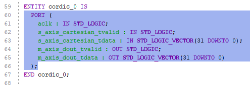

module name is cordic_0, it's port interface looks like this:

If a blank project had been created in verilog, the IP would have created a verilog version of the cordic_0, and this project would have been even easier. 

So the major design is over. Just create a top level module, read 16 unsigned (integer) get 16 unsigned bits out and display using 7seg display.  Figuring out the decimal place version of this is another project. Just proved this simple part works. 

Found a verilog open source Cordic at [opencores](https://opencores.org/projects?expanded=Arithmetic%20core) .. need to register to download it and maybe compare. 

## 3_Xilinx Clock IP

Why? We have already counted with a clock. The crystal is going at 100Mhz. Reading the clock wizard manual will not help.  

*Clocking on most large projects is as complicated as the logic and writing the verilog code. To give you an idea, [watch this video at 2:37 and stop at 3:58](https://youtu.be/UmQ0PUEaOuk?t=153). (1.5 minutes).  What is a logically exclusive clock group?  Search and link up the  best description right now.* 

*Then [watch this video from 1:12 and stop at 3:34](https://youtu.be/zw29hnWwIrU?t=73) .  What is ground bounce? Search and link up the best description right now.* 

One solution seems to be moving stuff around in the FPGA.  [Starting watching again here for a few seconds.](https://youtu.be/zw29hnWwIrU?t=897)  The speaker was talking about the [skew problem](https://en.wikipedia.org/wiki/Clock_skew).  Listen for as long as you can as this graphic is talked about: 

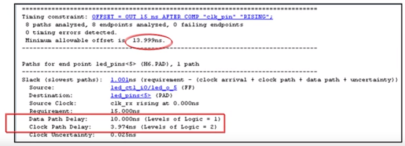

Form a hypothesis off the top of your mind to mind that is possibly relevant that answers these questions: 

*Offset occurs between two things. What two things is the 13.999 ns between?* 

*Given the speed of light is approximately 3\*10^8 m/s, estimate the speed of energy through the  data_path and clock_path:*

*Why would the clock path be traversed quicker than the data path which takes short cuts through the FPGA while clock path goes around the edges?* 

*What is the difference between a clock path and a control path?*

*How much of this is about the time it takes to get through a series of FlipFLops and how much is about getting through async combinatory circuits?* 

*The video talks about moving pads around. Why is this impossible for us?*

*How will programming an FPGA be different without a board like the Nexys4DDR?*

After listening to these videos, the terms can be separated into three groups:
	what goes wrong in a circuit ... metastable   
	classifying, categorizing, collecting data on circuit clocks .. logically exclusive clock groups   
	physics problems .. skew, ground bounce, jitter, .... long list   
	solutions: delay, physically moving circuit components around on the FPGA

*Where have we experienced [metastability](https://en.wikipedia.org/wiki/Metastability_(electronics)) while testing a project on the Nexys4DDR board?*

Getting into this detail is the subject of another course. 

Right now the goal is to understand the big picture scope of the problem, and then begin our first good habit with respect to these clock issues.  That is understanding when to begin using the Xilinx Clock IP. 

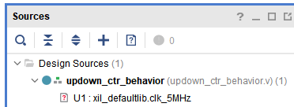

Suppose your goal is to add the IP, connect up the 7seg display and count, again. Read the [Xilinx Clock IP pdf](assets/pg065-clk-wiz.pdf) (published Feb. 25, 2019).

*Is the Xilinx clock intended to replace the sync, async, reset , set clock issues and help us divide clocks or something else?* 

*What is the maximum frequency the Xilinx Clock can generate?*

*What is the minimum frequency the Xilinx Clock can generate?*

*What are the possible future projects where you will want to use the Xilinx Clock?*

