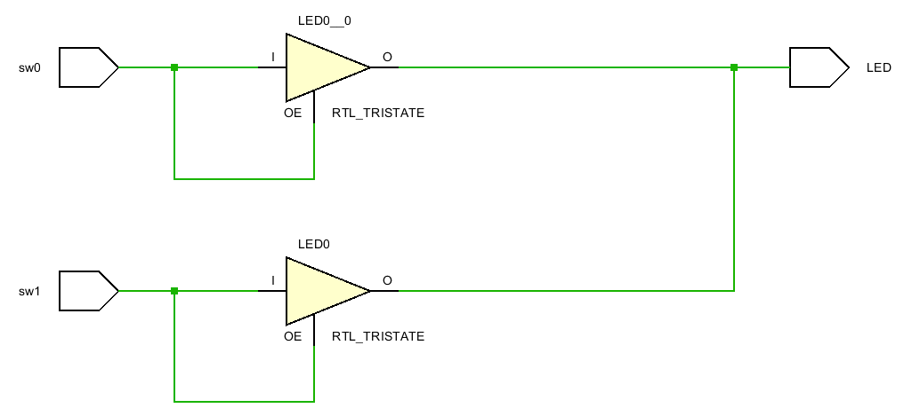
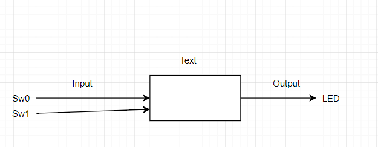
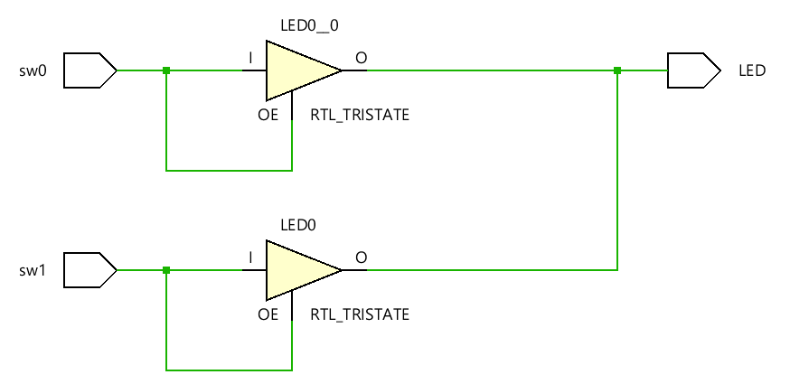
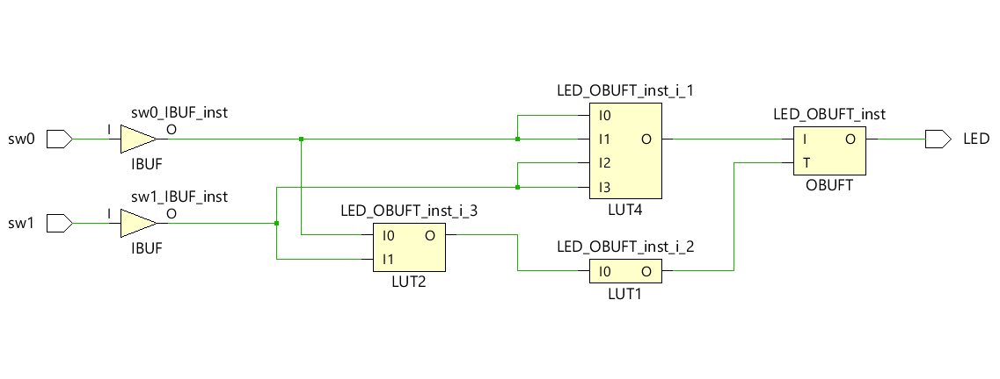
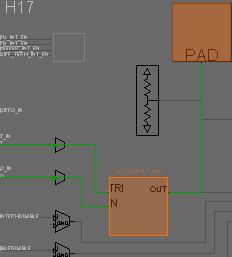
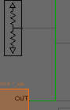
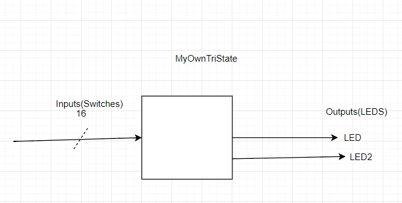
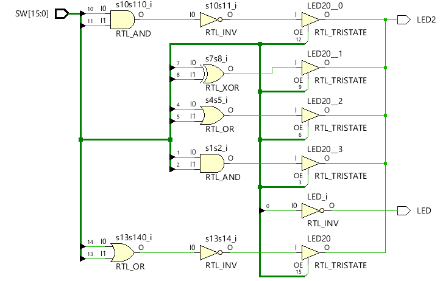
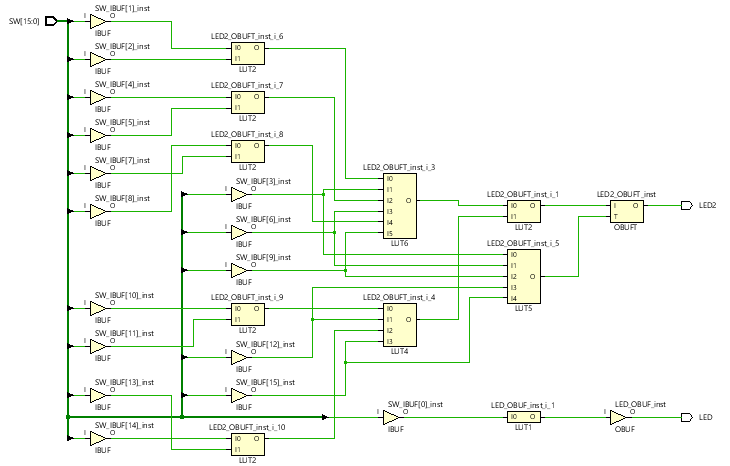
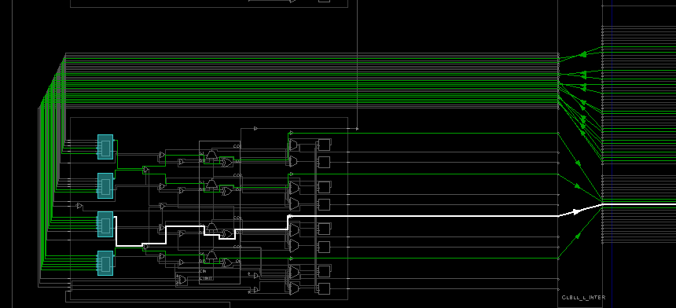

# Voltage Controlled Buffers  
Why doesn't **Vivado** allow two switches to control one LED?  Because one switch could try to send "on" to the LED. The other switch could try to send "off" to the LED.  They would fight.  Ultimately something would burn up .. the Nexys4 DDR board would be damaged. 

This is solved by moving from two states of on or off to three states or "triState" which include states of on, off and don't care.  Don't care has many names including "open" and "high  impedance", and "infinite output impedance".

#### Port Diagram

#### Verilog Code

`timescale 1ns / 1ps

module vcb(
   input  sw0,
   input  sw1,
   output tri LED
   );

   bufif1 b3(LED, sw0, sw0);
   bufif1 b1(LED, sw1, sw1);
endmodule

#### RTL Schematic Screen shot

#### Synthesis Schematic Screen shot

#### Implementation Device screen shot zoomed in on something interesting  

picture of the tristate inputs

#### Testing

Here is the above different from the two state situation from the first lab.  When sw0 is 0, the tristate buffer doesn't try to ground the LED. It outputs nothing. *What is the difference between 0 (false) and nothing .. don't care .. high input impedance... etc?* 

​	A false is grounded, and all points connected must be false, nothing is disconnected, and all points connected are undetermined.

*What happens when both switches are zero (false)? What could happen?*

​	When both switches are zero, the output is also zero. Without accounting for that case, the output could be a weak true, or be influenced by  outside factors easily.

*So what is the difference between 0 and off?* 

​	Zero is grounded, so the value is known, off is nothing, so the point in not determined.

*What is the difference between 0 and 1?* 

​	Zero is grounded and has a known value, one is powered or high and also has a known value.

*What does a designer have to worry about when working with tri-state?* 

​	They have to account for the don't care case or the output could be undetermined

*What kind of gate (and, nand, or, nor, xor, xnor, not) is this circuit?*

​	Or gate.

*Zoom in on a pull down resistor*

## BeCreative!

Hook the switches to the LED's in some creative way of your choice using the concepts you learned in this lab.  Think about the circuits that cell phones are going to control in your home. Imagine all the remotes, all the physical wall switches, all the on off  buttons and dimmer buttons in all devices begin controlled by your cell phone. You are designing a circuit to be imbedded in all devices and walls. 

#### Port Diagram

#### Verilog Code

module Tri(
    input [15:0] SW,
    output LED,
    output LED2

    );
    wire s1s2, s4s5, s7s8, s10s11, s13s14, s0;
    assign s1s2 =  SW[1]&SW[2];
    assign s4s5 = SW[4]|SW[5];
    assign s7s8 = SW[7]^SW[8];
    assign s10s11 = !(SW[10]&SW[11]);
    assign s13s14 = !(SW[14]|SW[13]);
    assign LED = !SW[0];
    bufif1 b1(LED2,s1s2,SW[3]);  //first 3 are and
    bufif1 b2(LED2,s4s5,SW[6]); //second 3 are or
    bufif1 b3(LED2, s7s8, SW[9]); // third 3 are xor
    bufif1 b4(LED2, s10s11,SW[12]); //fourth trio are nand
    bufif1 b5(LED2, s13s14, SW[15]); //fifth trio are nor

​    
​    
endmodule

#### RTL Schematic Screen shot

#### Synthesis Schematic Screen shot

#### Implementation Device screen shot zoomed in on something interesting

this is one of the logic portions that combine all of the inputs into fewer outputs, I don't really understand how this can remain consistent with the ideas of tristate, considering it compresses all of the inputs first anyway, making the "don't care" scenario seem useless.

Many people are replacing light bulbs with LED's that last forever. Most are 12 volt DC.  They are being connected to AC through wall warts that waste energy. Some are running 12 volt systems in parallel with the AC. Some are using AC to switch the 12 volt. 

​	[wikipedia Multiway_Switching Traveler_system_2](https://en.wikipedia.org/wiki/Multiway_switching#Traveler_system_2)

There is a transition, a business opportunity, a standards opportunity here.  Compare the "3-way" and "4-way switches" at Home Depot or Lowes.  

*Can a voltage controlled buffer reduce the amount of copper needed?*

